# foobar2000 Web Theme

> **v2.4.0** — 全面审查修复 · 渲染层模块化 · 含引号标签查询修复 · SDK 1.13.0

这是一个专为 foobar2000 音频播放器设计的现代化网页风格主题（Theme）。它基于 Web 技术构建，提供了发现音乐、媒体库管理、强大的播放控制以及独特的黑胶视觉效果。

## 图片展示

  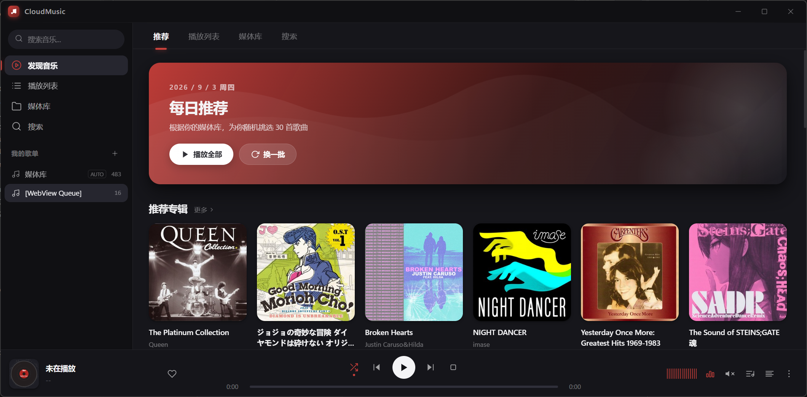
  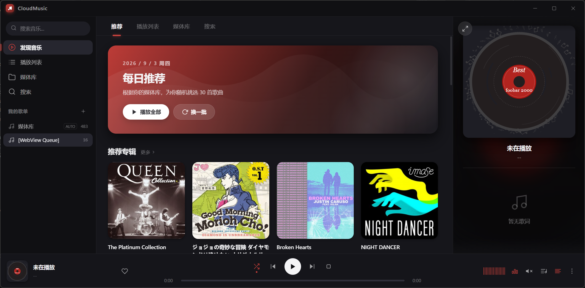
  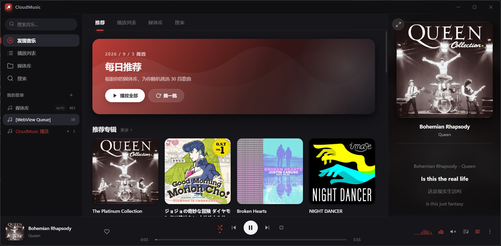
  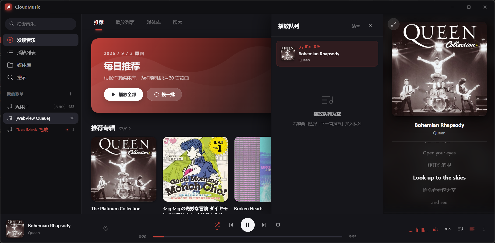
  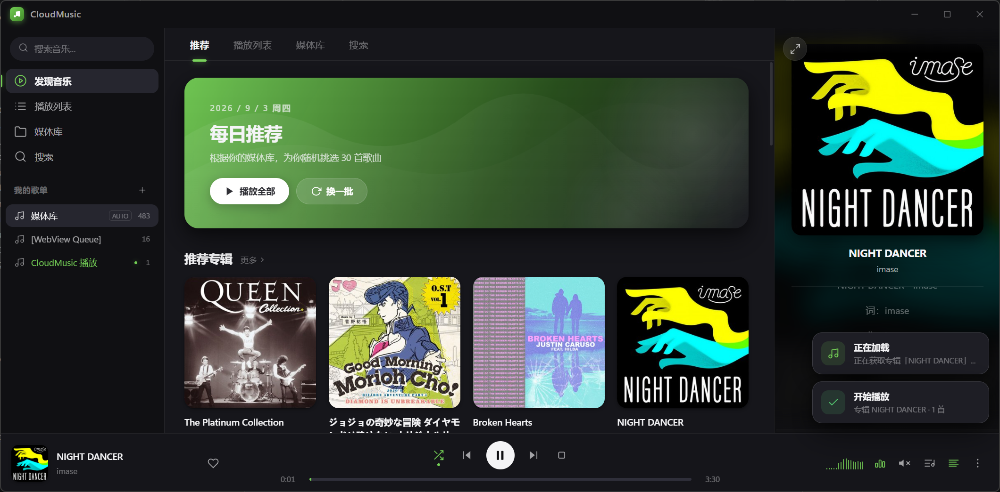
  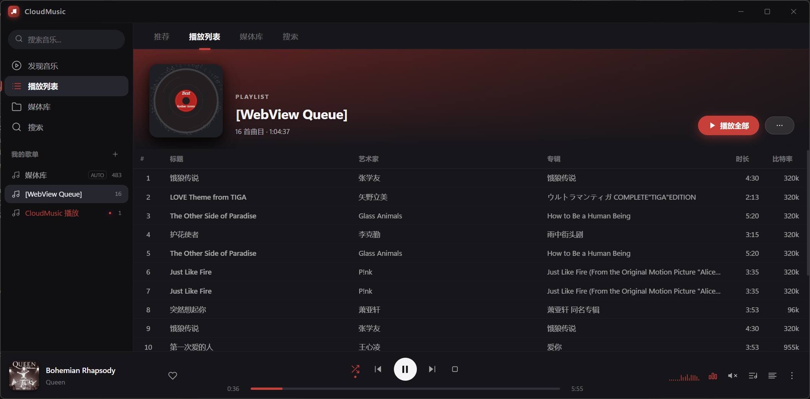
  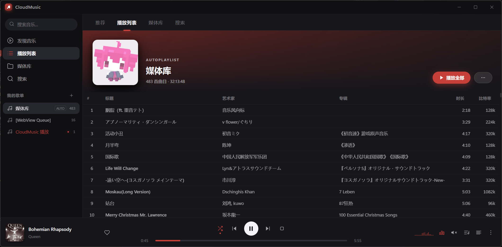
  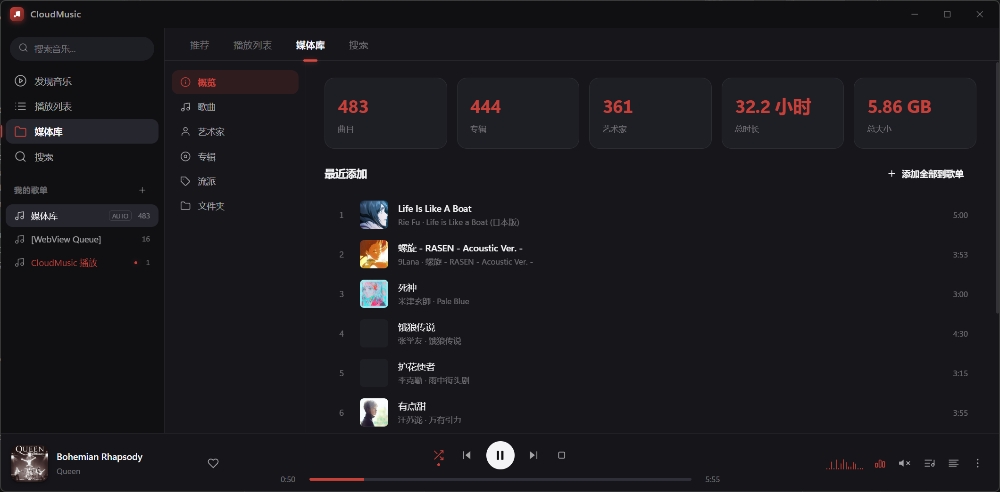
  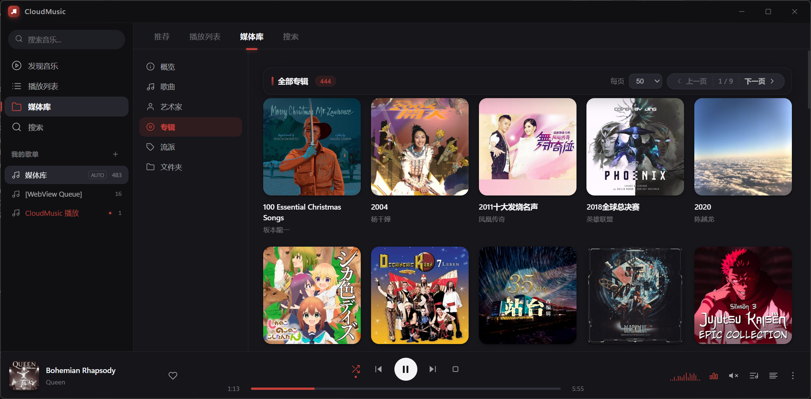
  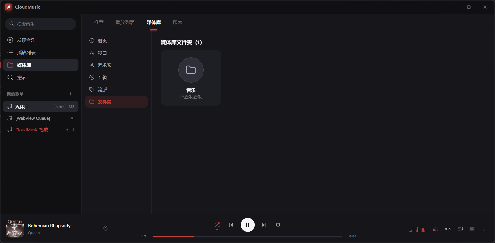
  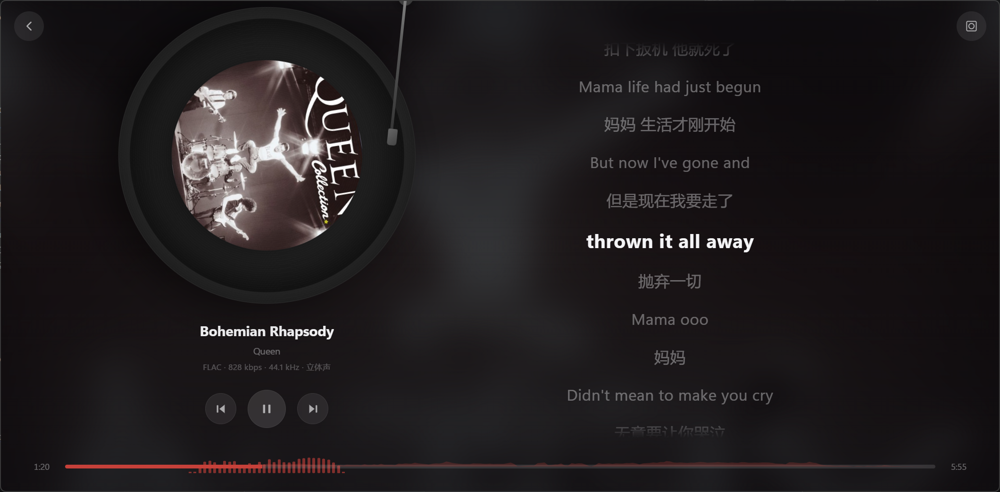
  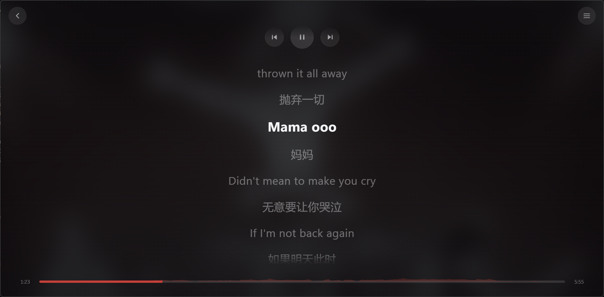
  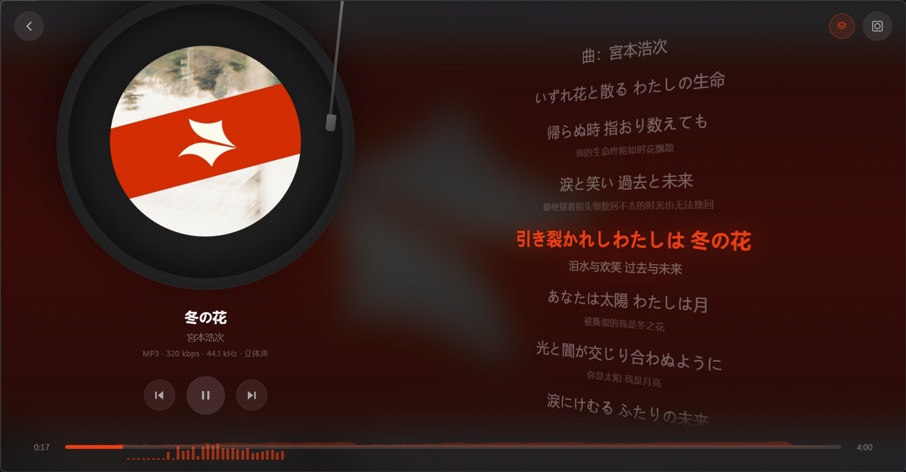

> **提示:** 拖动滑块可查看更多界面展示图片。

## 核心特性

- **现代化 Web 界面**: 采用简洁大气的设计风格，支持响应式布局，专为桌面端优化。
- **沉浸式黑胶体验**: 独特的 Vinyl 动画播放器，包含唱片旋转和唱针动画，还原真实听歌氛围。
- **发现与探索**: 专属“发现”页面，展示推荐专辑、随机曲目和最近播放记录。
- **动态歌词**: 集成歌词显示功能，支持卡拉 OK 逐字高亮，并提供独立的全屏歌词模式。
- **强大的媒体库**: 支持按艺术家、专辑等维度浏览与管理本地音乐。
- **内置标签编辑**: 无需离开界面即可在“标签编辑器”中修改歌曲元数据，支持批量操作。
- **播放队列管理**: 抽屉式播放队列，支持拖拽排序。

## 环境要求

1.  **foobar2000**: 确保已安装 foobar2000 音频播放器。
2.  **foo-ui-webview2**: 运行此主题所必需的 foobar2000 组件插件。请前往 [GitHub - NereaFantasia/foo_ui_webview2](http://github.com/NereaFantasia/foo_ui_webview2) 下载并安装对应版本。

## 安装指南

1.  **获取主题**: 将本项目（`foobar2000_web_theme`）下载或克隆到本地。
2.  **定位路径**: 确认包含 `index.html` 文件的目录绝对路径。
3.  **配置插件**:
    *   打开 foobar2000，进入 `文件 -> 参数选项` (或按 `Ctrl+P`)。
    *   依次进入 `显示` -> `WebView` 选项。
    *   将 `Home URL` (或类似入口设置) 设置为本地 `index.html` 文件的路径 (`file:///C:/.../index.html`)。

## 项目结构

本项目采用模块化结构，便于维护和二次开发：

- `index.html`: 单页应用入口，构建整个应用界面结构（侧边栏、主页、弹窗等）。
- `guide.html`: 包含详细的版本更新日志、功能特性说明及键盘快捷键指南。
- `css/`: 样式表目录。
    - `layout.css`: 整体布局（侧边栏、主内容区、底部栏）。
    - `components.css`: 各功能组件样式（歌单页、发现页、歌词、播放控制、黑胶唱盘）。
    - `utilities.css`: 通用工具类（弹窗、上下文菜单、提示条）。
- `js/`: 核心业务逻辑与渲染模块。
    - `core.js`: API 封装与状态管理。
    - `ui.js`: 基础渲染层。
    - `ui-discover.js`, `ui-playlist.js`, `ui-library.js`: 各主要页面的视图逻辑。
    - `ui-nowplaying.js`: 沉浸式播放模式（含黑胶动画逻辑）。
    - `ui-tags.js`: 标签编辑器与批量操作逻辑。
    - `controls.js`: 播放控制交互绑定。
    - `app.js`: 初始化入口。
- `sdk/`: API 桥接文件 (`bridge.global.js` 等)，负责与 foobar2000 核心交互。
- `static/`: 静态资源文件（图片、占位符 SVG）。

## 快捷键与操作

- **侧边栏导航**: 使用左侧边栏切换“发现”、“播放列表”、“媒体库”和“搜索”功能。
- **播放控制**: 底部控制栏提供播放/暂停、上一首/下一首、进度条拖拽及音量调节。
- **全屏歌词/沉浸模式**: 点击底部或右上角的全屏按钮进入黑胶沉浸模式。
- **编辑标签**: 在歌曲列表中右键点击曲目，选择“编辑标签”进行修改。多选曲目可进行批量编辑。

## 贡献与反馈

如果您喜欢这个主题，欢迎在 Gitee 或 GitHub 上为我们点亮 Star。

如遇到问题或有任何建议，请移步项目 Issues 页提交反馈。