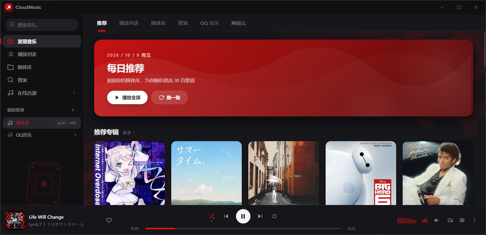

# CloudMusic — foobar2000 WebView2 主题

> **v3.0.0** — 适配 foo_ui_webview2 2.0.0（参数严格校验的破坏性修复 + 实时声场 / 播放时钟 / 歌单 GUID / 小窗）；入口重排（更多菜单瘦成四段、长内容折叠成组、新增独立「设置与工具」页）；小窗改为独立窗口并在无响应时自愈、托盘单击 / 双击叫回主窗口；

这是一个专为 foobar2000 音频播放器设计的网易云风格主题。基于 WebView2 构建，提供了发现音乐、媒体库管理、强大的播放控制以及独特的黑胶视觉效果。

## 图片展示

<table>
  <tr>
    <td></td>
    <td></td>
    <td></td>
  </tr>
  <tr>
    <td></td>
    <td></td>
    <td></td>
  </tr>
  <tr>
    <td></td>
    <td></td>
    <td></td>
  </tr>
  <tr>
    <td></td>
    <td></td>
    <td></td>
  </tr>
</table>

## 核心特性

- **现代化 Web 界面**: 采用简洁大气的设计风格，支持响应式布局，专为桌面端优化。
- **沉浸式黑胶体验**: 独特的 Vinyl 动画播放器，包含唱片旋转和唱针动画，还原真实听歌氛围。
- **沉浸式 3D 歌词墙**: 全屏歌词可切换为“整块歌词贴在一面斜墙上”的 CSS 3D 透视效果，当前行从墙面微微鼓起，并带随封面主色调联动的柔光。开关在右上角、状态记忆、默认关闭。
- **发现与探索**: 专属“发现”页面，展示推荐专辑、随机曲目和最近播放记录。
- **动态歌词**: 支持逐行与**逐字**（ESLyric `<mm:ss.xx>` 精准歌词）高亮、**双语翻译成组显示**（同刻 / 译文延后一行两种写法自动判别归一、原文为主译文为副）、点行跳转与独立的全屏歌词模式；歌词面板右键菜单可手动指定配对方式（按文件记忆）。内置 8 层编码检测引擎，可正确识别 GBK/GB18030、UTF-8、UTF-16 等编码的 LRC 文件。
- **强大的媒体库**: 支持按艺术家、专辑等维度浏览与管理本地音乐。
- **QQ 音乐在线音源（可选）**: 页内桥接，「QQ 音乐」页可直接搜索并播放、勾选播放与下载（无损/母带落盘），自动匹配在线封面与歌词，支持「复制导出脚本 + 文本匹配」导入自己的 QQ 歌单；不需要外部桥接程序、端口或 node.js。见下方专节。
- **网易云音乐在线音源（可选）**: 与 QQ 音乐同一套页内桥接架构的第二个平台页 —— 免登录的免费额度更宽（多为 320K），**在线即可听无损 FLAC**，歌单可直接粘贴链接/ID 导入，会员曲目会明确标注「VIP · 试听」并跳过。同样无外部程序 / 端口 / node.js。见下方专节。
- **内置标签编辑**: 无需离开界面即可在“标签编辑器”中修改歌曲元数据；多选后可批量编辑标签或批量从歌单删除。
- **插队队列（双轨制播放）**: 右侧抽屉就是 foobar2000 的原生播放队列 —— 中间大列表是「播放上下文」（双击才切换），右侧是「插队队列」（优先级最高、播完一首移一首、播完回到中间列表继续）；右键「下一首播放 / 添加到插入队列」插队而不动中间列表，支持拖拽排序。
- **播放历史**: 插队队列上方那行「播放历史」按钮（默认收起、展开状态记住）—— 点开是从旧到新的只读时间线（默认 20 条、设置页可调），最新一条紧贴"正在播放"，整条抽屉自上而下就是「过去 → 现在 → 接下来」；「上一首」优先沿它回溯，双击任意一条即可回到那首。

## 环境要求

1.  **foobar2000**: 确保已安装 foobar2000 音频播放器。
2.  **foo-ui-webview2**: 运行此主题所必需的 foobar2000 组件插件。请前往 [GitHub - NereaFantasia/foo_ui_webview2](http://github.com/NereaFantasia/foo_ui_webview2) 下载并安装对应版本。**v3.0.0 起要求组件 2.0.0 或更高**（主题按 2.0.0 的严格参数校验与新 API 适配；组件 2.x 内不再有破坏性变更）。

## 安装指南

1.  **获取主题**: 将本项目（`foobar2000_web_theme`）下载或克隆到本地。
2.  **定位路径**: 确认包含 `index.html` 文件的目录绝对路径。
3.  **配置插件**:
    *   重新进入foobar设置页面
    

## QQ 音乐在线音源

侧边栏「QQ 音乐」页 = 搜索 → 勾选 → 在 foobar2000 播放 / 下载选中。整条链路（搜索 / 直链解析 / 歌词 / 封面）都在主题页面内走宿主 foo_ui_webview2 的原生 HTTP 客户端，**没有本地进程、端口、开关脚本，也不需要 node.js / Python**；随 foobar 启动而在、关闭而消。功能创意与原版桥接程序来自贴吧用户 @凌月冰天。

- **免登录可用**：免费曲库（128K MP3 / AAC 96K）直接搜、直接放。**VIP 曲目 / 无损**需要在浏览器登录 `y.qq.com` 后按页面右上角「设置 Cookie」的说明粘贴一次 Cookie（存 localStorage；失效重贴即可，表现为 VIP 曲目全部解析不到）。
- **在线播放固定 MP3 流播，无损走下载**：QQ 的 CDN 给所有直链打的 `Content-Type` 都是 `audio/x-ogg`，foobar2000 会按类型把 FLAC / AAC 直链误当 Ogg 拒解，所以在线播放只解析 MP3 档（320 → 128，保证可播）。**音质下拉框只影响下载**：要无损 / 母带，用「下载选中」落盘后在本地播放（文件字节完好，可直接加进媒体库）。
- **下载位置固定**：`<foobar2000 配置目录>\QQ音乐下载\`（宿主的写盘策略只放行配置目录）。下载开始后列表上方会常驻显示「下载保存到 …」，可一键打开文件夹或复制路径；音频与同名 `.lrc` 一起写入，整目录可加进媒体库。下载中再点一次 = 停止。
- **「QQ音乐」歌单**：勾选播放的曲目会**追加**到这个固定歌单末尾并从新曲开播，之前播的歌原地保留。歌单里存的是带签名的 CDN 直链，**vkey 约两小时过期**，过期条目再点会播放失败 —— 回页面重新勾选播放即可刷新（无损/母带请下载落盘，更稳）。
- **导入自己的歌单**：「导入歌单」面板点「复制导出脚本」→ 到 `y.qq.com` 歌单页 F12 控制台粘贴回车（脚本自动滚动抓全曲目，导出「歌名 - 歌手」每行一首）→ 回主题粘贴文本、指定目标歌单名开始导入。逐首多轮搜索匹配（宁缺勿错，失败行会放回文本框可编辑重试），单次上限 300 首、可随时停止。
- **封面与歌词自动匹配**：在线曲目的封面由「直链文件名里的 mediaMid → 专辑」反查腾讯图床得到（会随播放/下载记录，缓存复用）；歌词按「标题 + 歌手 + 时长」多轮放宽搜索匹配，本地同名 `.lrc` / `%profile%\lyrics` 歌词库优先。**歌词面板右键 →「刷新歌词」**会同时清掉在线匹配缓存。
- **在线曲目没有本地文件**：右键菜单的「编辑标签」「在资源管理器中显示」会置灰并说明原因（批量标签编辑会自动跳过在线曲目）；星级评分、封面、歌词、波形、插队（下一首播放 / 添加到插入队列）这些不受影响。

## 网易云音乐在线音源

侧边栏「网易云」页 = 搜索 → 勾选 → 在 foobar2000 播放 / 下载选中。与「QQ 音乐」页同一套**页内桥接**架构（`js/netease-core.js` + `js/ui-netease.js`）：搜索 / 直链解析 / 歌词 / 封面 / 歌单全部走宿主 foo_ui_webview2 的原生 HTTP 客户端，**无本地进程、端口、node.js 依赖**。

免登录就能用，而且免登录的额度比 QQ 宽松很多（同一批热门搜索实测：约一半曲目**完整可放**，其中绝大多数是 320K；QQ 那边免登录多为 128K 且可放比例更低）。

- **会员曲目会明确标注**：未登录 / 非会员时，会员曲目接口照样返回一个能播的 URL，但内容是 **30/45 秒试听片段** —— 页面把这类曲目标成「VIP · 试听」并在播放/下载时跳过，**不会往歌单里塞 30 秒的"歌"**。
- **在线就能听无损**：网易云 FLAC 直链的 `Content-Type` 是 `application/octet-stream`（MP3 是 `audio/mpeg`），foobar 按内容嗅探即可正确解码 —— 不像 QQ 那边被 `audio/x-ogg` 干扰、只能流播 MP3。所以音质下拉框（标准 128K / 较高 192K / 极高 320K / 无损 FLAC / Hi-Res）**同时作用于在线播放与下载**；要不到的高档位自动降级，并按返回的真实档位如实回填（不会把降级结果报成无损）。
- **登录（可选）**：点「登录 / Cookie」展开面板 —— 与「QQ 音乐」页同一套最简模型：**再点一次收起（与「导入歌单」同一套开关手感），面板里也有「收起」**，面板与搜索 / 列表共存；取 Cookie 的步骤收在「怎么取？」里按需展开。登录态在 `MUSIC_U` 上，而它是 **HttpOnly** 的 —— 控制台里 `copy(document.cookie)` **读不到**它，localStorage / sessionStorage / IndexedDB 里也没有副本，所以只能去开发者工具里取：F12 → 网络 → 任选一个请求 → 右键「以 cURL 格式复制」→ 整条粘贴到面板（会自动挑出 Cookie），或从「应用 → 存储 → Cookie」复制 `MUSIC_U`。保存后**当场校验**并回报「登录成功 + 会员有效期至 X」。
- **歌单导入：直接粘贴链接或 ID**（公开歌单与官方榜单免登录可读全部曲目，实测 200 首一次拿全），不需要 QQ 那套「导出脚本 + 文本匹配」。单次上限 300 首，只有试听片段的曲目会被跳过并说明原因。
- **封面与歌词**：搜索响应自带封面直链（取图时缩到 `?param=500y500`，原图 5MB → 约 330KB），无防盗链。歌词取原文 + 译文（同刻，交给主题归组）；逐字歌词网易云只在加密接口里给，这里拿不到。在线曲目播放/下载时记下「直链 → 歌曲 id / 封面」映射，歌词按 id **精确**取词（比按标题匹配更准），封面兜底据此反查。
- **播放落在「网易云音乐」歌单**：勾选播放的曲目会追加到这个固定歌单并从新曲开播，与「QQ音乐」歌单分开，一眼能看出曲目来自哪个平台。
- **下载位置固定**：`<foobar2000 配置目录>\网易云音乐下载\`，音频与同名 `.lrc` 一起写入。
- **搜索限流已处理**：网易云搜索接口有限流（连续快速请求会回 `code=406 操作频繁`），桥接把搜索串行化并留最小间隔；真被限流时状态栏如实提示稍后再试，且**只影响搜索** —— 同一时刻播放直链 / 歌词 / 封面照常工作（已实测）。

## 双语歌词编辑器（可选，独立于主题）

`tools/lrc-normalizer.html` 是一个**独立的编辑器**，主题不会加载它，按需使用。浏览器直接打开该文件即可，纯本地运行、不联网、不上传。

**为什么需要它**：双语歌词没有统一规范（同刻 / 译文晚一行，还有混用、缺译文、部分翻译等），而且有些文件**写法本身就是错的或自相矛盾的** —— 这种情况下任何自动判断都无法可靠还原。所以这里不猜：给一个能自己动手改的编辑器，加一键识别打底。

**也能从零做时间轴**：手里只有一段纯文本歌词（从网页复制来的原文 + 译文，一个时间戳都没有）时，把歌曲和歌词一起丢进去，播放后跟着节奏按空格打轴，译文行会自动跳过，最后导出成标准 LRC。歌词文本也可以直接粘贴，不必先存成 .lrc 文件。

界面分成**两页**，共用同一份歌词（工具条和播放器两页都在）：

**第 1 页「编辑歌词」**
- **一键识别**：按机械规则逐时间戳块分配主/译文（块内有空槽或制作信息 → 正文都是原文；多行正文 → 首行是上一句的译文；单行 → 原文）。和主题「兼容旧版」用的是同一套规则。
- **手动调整**（编辑器主要能力）：
  - 点行首角色徽标即可在 **主歌词 / 译文** 之间切换；行尾还有「设为译文」「设为主歌词」按钮
  - **↑ ↓** 调整任意行的位置（例如把译文挪到它真正的原文后面）
  - 时间戳可直接点着改；行正文可双击编辑；可删除多余行（如 `//` 占位）
  - **Ctrl+Z / Ctrl+Y** 撤销重做（100 步）
- **实时预览**：右侧按分组的「主 + 译文」显示，和主题里的显示结构一致
- **粘贴文本**：不用非要拖 .lrc —— 点「粘贴文本」把网页 / 记事本里的歌词整段粘进来即可。带 `[mm:ss.xx]` 的行按时间戳解析；**纯文本（没有时间戳）就把所有行的时间戳设为 `00:00.000`**，等你去「打轴」页排；`[ti:]` `[ar:]` 这类元信息行自动归到文件头
  - 粘贴「原文一行、译文一行」交替的双语歌词后，点「**交替配对**」即可把译文行标出来（首行角色不对就先点一下首行徽标再配对）

**第 2 页「打轴」（边听边打时间戳）**
- 顶部播放器：**载入歌曲**（点按钮，或把音频文件拖进窗口 —— 音频进播放器、.lrc/.txt 进歌词，一次拖入两个都生效）、播放/暂停、±5s、可拖进度条、0.5×–1.5× 变速（慢放打轴，时间戳仍是真实时间）
- 载入歌词 → 播放 → 跟着节奏**按空格**（或回车 / 点「打轴」大按钮）就把当前播放时间打给目标行，打完自动跳下一句；勾选「**跳过译文行**」时译文行不会被停下来（它的时间在导出时按所选写法统一写）
- 快捷键：**空格 / 回车** 打轴 · **Backspace** 撤销上一次（数据和时间戳都退回上一句）· **P** 播放/暂停 · **← →** ∓3 秒（Shift 微调 0.5 秒）· **S** 从此行播（回退 1.2 秒起播）
- 下面的歌词列表**点任意一行 = 从那一句开始打**（重打某几句时用）；「回到第一句」把目标放回开头，「全部归零」把所有歌词行时间戳清成 `00:00.000`（可撤销）
- 支持浏览器能解码的格式（mp3 / m4a / flac / wav / ogg 等）；APE / WMA / DSD 打不开会提示

**导出**：选「标准双语」（译文与原文同刻）或「兼容旧版」（译文写在下一句原文时间戳上）后下载；**只改时间戳与行顺序，不改一个字**；元信息行（`[ti:]` `[ar:]` …）原样保留；UTF-8 带 BOM，可直接覆盖原文件（建议先备份）。文件按**时间戳升序**排列（同一时间戳保持列表先后、主歌词在译文前），所以只重打一句也不会出现时间倒退；若还有多行是 `00:00.000`（多半是没打完），下载前会弹窗提示。
- 实测：抽样 60 个歌词文件「一键识别 + 导出标准双语」后，在主题里 **60/60 都能被确定性识别**（不再依赖任何猜测）

## 项目结构

本项目采用模块化结构，便于维护和二次开发：

- `index.html`: 单页应用入口，构建整个应用界面结构（侧边栏、主页、弹窗等）。
- `popup.html` + `js/popup.js`: **小窗页面**（迷你播放器 / 歌词窗），由 `window.createPopup` 打开；曲名/歌词/封面/强调色从宿主的跨窗口状态（`fb.sharedState` 的 `cm:now` / `cm:lyrics` / `cm:art` / `cm:theme`）取主窗口算好的结果，进度由小窗自己的 `PlaybackClock` 推进；**窗口几何与形态由小窗经 `window.sendMessage` 报给主窗口保存**（两个窗口共享同一份 localStorage，小窗自己写会把主窗口刚存的设置冲掉）。
- `guide.html`: 功能指南（操作说明 / 键盘快捷键 / 更多菜单 / 各页面用法）。**更新日志只列要点** —— 完整历史在主题目录外的 `docs/changelog.html`，不随主题打包。
- `css/`: 样式表目录。
    - `layout.css`: 整体布局（侧边栏、主内容区、底部栏）。
    - `components.css`: 各功能组件样式（歌单页、发现页、歌词、播放控制、黑胶唱盘）。
    - `utilities.css`: 通用工具类（弹窗、上下文菜单、提示条）。
- `js/`: 核心业务逻辑与渲染模块。
    - `core.js`: API 封装与状态管理。
    - `lyric-core.js`: 多编码歌词引擎（8 层编码检测 + LRC/ESLRC 模块化解析 + 同刻行归组）。
    - `playback-model.js`: **双轨制播放模型** —— 中间列表 = 播放上下文（活动播放列表）、右侧 = 插队队列（`fb.queue.*` 原生播放队列）、外加事件栈 + cursor 的播放历史。「播放这一行」「下一首/上一首」「切换上下文时清空插队队列」都收在这一个模块里；媒体库 / 发现 / 搜索这类「视图列表」经 `_MediaLibraryContext_` 专用歌单映射成可延续的上下文（该歌单不显示在侧栏）。
    - `ui.js`: 基础渲染层。
    - `ui-lyrics.js`: 歌词面板加载与渲染。
    - `ui-discover.js`, `ui-playlist.js`, `ui-library.js`: 各主要页面的视图逻辑。
    - `ui-nowplaying.js`: 沉浸式播放模式（黑胶动画 + 歌词 3D 斜墙）。
    - `ui-tags.js`: 标签编辑器与批量编辑 / 批量删除逻辑。
    - `qqmusic-core.js`: QQ 音乐页内桥接（搜索 / 直链解析 / 歌词匹配 / 封面下载 / Cookie）。所有上游 HTTP 走宿主的**异步**客户端（`async:true` + `http:response` 事件 + `http.abort` 超时取消）—— 用 `async:false` 会让宿主在自己的 UI 线程上做完整个请求，请求多慢 foobar 主窗口就假死多久。功能创意与原版桥接来自贴吧 @凌月冰天。
    - `ui-qqmusic.js`: QQ 音乐在线音源页（搜索 / 翻页 / 勾选播放 / 下载 / 歌单导入 / Cookie 面板）。
    - `netease-core.js`: 网易云音乐页内桥接（搜索 / 批量直链解析 / 歌词匹配 / 封面 / 歌单读取 / Cookie）——与 QQ 桥接同构，同样全异步走宿主 HTTP；免签名接口（cloudsearch、player/url、lyric、v6/playlist/detail），搜索带串行化与限流冷却，试听片段（30/45 秒）单独识别。
    - `ui-netease.js`: 网易云音乐在线音源页（搜索 / 翻页 / 勾选播放 / 下载 / 按链接或 ID 导入歌单 / Cookie 面板 + 保存后校验会员状态）。
    - `lyrics-resolver.js`: 歌词加载链路（本地同名 .lrc / 歌词库优先 → 页内桥接联网匹配兜底；在线曲目按直链归属分发到 QQBridge / NeteaseBridge，网易云走「直链反查 id → 按 id 精确取词」）。
    - `artwork-resolver.js`: 封面就近兜底（封面目录扫描打分 + 在线曲目专辑图反查，在线图经 QQBridge / NeteaseBridge 的 `coverDataUrl` 缓存下载）。
    - `qq-playlist-export.js`: QQ 音乐歌单导出脚本（「导入歌单」面板「复制导出脚本」按钮的源码，粘贴到 y.qq.com 歌单页控制台运行）。
    - `audio-viz.js`: 频谱数据源（v2 的 `audio.subscribeSpectrum` 原始频点 + 立体声，按对数轴合并成主题频谱条要的条数；不负责显示）。订阅按**持有者计数**：底栏迷你频谱与沉浸页各自 `hold`/`drop`，最后一个离开才退订；宿主没有频点输出或 1.5 秒无帧自动回退频带；播放中断流有看门狗重订。
    - `controls.js`: 播放控制交互绑定（底栏、更多菜单、EQ / 播放增益 / 输出设备面板、原生主菜单与诊断面板）。
    - `tray.js`: 常驻托盘（图标 / 悬停提示跟随曲目 / 左键单击与双击都把主窗口叫回前台 / 原生菜单，页面挂起时播放控制由组件原生执行）。
    - `lyrics-sources.js`: 在线歌词多源聚合（LRCLIB / 网易云 / QQ 音乐，统一 search/fetch + 打分排序；只发元数据不发路径）。
    - `ui-settings.js`: **「设置与工具」页**（外观与可视化 / 歌词 / 窗口与小窗 / foobar2000 工具 / 关于与帮助），低频项与排障工具都收在这里；入口是底栏「更多 → 设置与工具」，**不在侧边栏**。
    - `app.js`: 初始化入口。
- `sdk/`: API 桥接文件，负责与 foobar2000 核心交互。**v3.0.0 起为 2.0.0 版**；`components.global.js` / `smp-compat.global.js` 主题未使用，默认不加载（需要时在 `index.html` 里把对应 `<script>` 加回）。
- `static/`: 静态资源文件（图片、占位符 SVG）。
- `tools/`: 独立小工具（`lrc-normalizer.html` 歌词编辑器/打轴器，主题不加载）。
- `docs/`: **主题目录之外的资料，不随主题打包**。`changelog.html` = 完整更新日志（v2.3 起的全部版本，`guide.html` 里只留精简版）。

## 快捷键与操作

- **侧边栏导航**: 使用左侧边栏切换“发现”、“播放列表”、“媒体库”、“搜索”，以及两个在线音源页「QQ 音乐」和「网易云」。
- **播放控制**: 底部控制栏提供播放/暂停、上一首/下一首、进度条拖拽及音量调节。取歌顺序是**双轨制**：下一首先播右侧「插队队列」的队首，队列空了才按中间列表（播放上下文）走；上一首先回溯「播放历史」，历史到头才回到上一首。
- **插队而不换歌单**: 右键曲目 →「下一首播放」（插队首）/「添加到插入队列」（追加队尾）—— 两个动作都只动右侧插队队列，中间列表与正在听的那张清单不受影响；双击中间列表的曲目才会切换播放上下文（并把插队队列清空）。
- **全屏歌词/沉浸模式**: 双击底栏左下角的封面进入黑胶沉浸模式（单击只是开合歌词面板），或点右侧歌词面板封面左上角的「进入沉浸模式」按钮。
- **编辑标签**: 在歌曲列表中右键点击曲目，选择“编辑标签”进行修改；多选 2 首及以上时，底部批量栏可批量编辑标签或从歌单删除（右键到已选中的曲目会整组删除）。
- **沉浸式 3D 斜墙**: 进入沉浸模式后，点右上角“显示模式”左侧的小圆钮切换（亮起为开启，状态自动记忆）。
- **歌词右键菜单**: 在歌词面板（或沉浸式页面的歌词区）右键打开 —— 三个二级菜单（鼠标悬停展开，与「翻译对齐方式」同一种展开方式）：「翻译对齐方式」（自动识别 / 标准双语 / 兼容旧版，选择按文件记忆）、「歌词工具」（搜索歌词 / 复制歌词 / 嵌入到歌曲标签 / 保存歌词到文件）、「小窗」（迷你播放器 / 歌词窗（竖版））；另有 刷新歌词 / 恢复自动匹配 / 打开所在文件夹。

## 更新摘要 · v3.0.0

> 适配 foo_ui_webview2 2.0.0；播放模型理顺为双轨制；入口重排；新增独立「设置与工具」页与小窗页面。**完整逐条说明见 [`docs/changelog.html`](docs/changelog.html)。**

### 新增功能

- **双轨制播放模型**：中间大列表 = 播放上下文（双击才切换），右侧抽屉 = foobar2000 原生播放队列（改名「插队队列」，优先级最高、播完一首移一首、播完回到中间列表继续）。右键「下一首播放」插队首、「添加到插入队列」追加队尾，都不动中间列表。媒体库 / 发现 / 搜索是「视图」而非歌单，播放时映射进不显示在侧栏的 `_MediaLibraryContext_`，**不再顶掉用户自己的歌单**。
- **播放历史**：插队队列上方的可展开只读时间线（事件栈 + cursor），默认 20 条（设置页可调 10/20/50/100）、localStorage 持久化、展开状态记住。「上一首」优先沿历史回溯，双击任意一条即回到那首。
- **「设置与工具」页**（入口：底栏「更多 → 设置与工具」，不占侧边栏）：外观与可视化 / 歌词 / 窗口与小窗 / foobar2000 工具 / 关于与帮助；旧宿主不支持的项目置灰并写明原因。
- **小窗页面**（`popup.html`，两种形态）：迷你播放器（520×168）与歌词窗（460×720），同一个页面用 `window.setSize` 现场换尺寸；样式与主界面同一套变量、跟随封面取色；曲名 / 歌词从跨窗口状态取主窗口已解析好的结果，不重复联网。
- **频谱五种显示**（都作用于沉浸页那一条）：频谱条 / 声场 / 瀑布图 / 示波器 / 矢量示波器。订阅改用 v2 的原始 FFT 频点 + 立体声（对数频率轴合并 + 时间平滑）；示波器与矢量示波器走官方 `audio.getWaveform`；`fftSize` 8192 → 2048。
- **播放时钟插值**：`fb.PlaybackClock` + `hostTime` 在 ~30fps 事件之间推算位置，进度条与歌词高亮不再一跳一跳；`canSeek` 让电台流等不可跳转曲目把进度条置灰。
- **歌单筛选**：歌单页标题下新增筛选框，查询语法与 foobar 搜索框一致（`playlist.getMatchingRows` + `getTracksAt`），行号仍是真实行号。
- **其他**：歌单身份改用 `playlistGuid`（改名 / 挪位也命中）；队列拖拽排序改用 `queue.setContents` 一次写完；标签编辑器支持真正的多值标签（`;` 分隔）；歌词新增 `lyrics.get` 兜底与「保存到文件 / 嵌入标签」；Win11 贴靠布局；拖放区分来源。
- **「更多」菜单瘦身**：从 20 项 + 3 层折叠收成**四段 —— 歌词 / 窗口 / 音频 / foobar2000**，长内容（桌面歌词 / 小窗 / 音频）折叠成组。**移除自绘桌面歌词窗**（桌面歌词继续走 ESLyric）与**移除「试听」**整条链路。

### 修复（重要）

- **适配 2.0.0 的三处必修**：`playback.setPosition` 参数改名（进度条拖拽 / 键盘跳转 / 点歌词跳转失效）、`library.getAll` 分页参数改名（「全部歌曲」打不开）、`library.getAlbumTracks` 必填 `album` + `albumArtist`（专辑封面 / 详情失效）。SDK 升至 2.0.0 并停止加载两个未使用的 SDK 脚本（约 278KB）。
- **播放顺序**：宿主 `order` 是序号 0..6 而非 foobar 标志位 —— 此前点「随机」实际设成 shuffle-tracks、图标读不回真实档位，现一律按 `name` 下发与识别。
- **小窗三处交互硬伤**：迷你播放器按钮被裁在窗口外、歌词窗当前句永不居中、小窗写设置会冲掉主窗口设置；尺寸单位由 CSS 像素按缩放比换算（此前 140% 缩放下小窗只有约 300×107 CSS 像素）。
- **频谱**：沉浸页重建 DOM 后画布被甩出文档（瀑布图 / 示波器变空条）、订阅改为按持有者计数（关掉底栏频谱不再连带停掉沉浸页）。
- **其他**：换歌瞬间保存歌词串台、「流派」页因多传参数整单被拒、筛选零命中显示整张歌单、「上次听歌的歌单」按名称恢复失效、进度条禁用态死代码、DPI 变化只感知一次、同名歌单清理误删用户歌单、小窗置顶 / 托盘关闭失败也报成功等。

## 更新摘要 · v2.5.4

**新增「网易云」页：第二个页内在线音源**

- **`js/netease-core.js` + `js/ui-netease.js`**：与 QQ 音乐页同构，搜索 / 直链 / 歌词 / 封面 / 歌单全部走宿主原生 HTTP（无本地进程 / 端口 / node.js），上游接口全部免签名。
- **在线即可听无损**：网易云 FLAC 直链的 `Content-Type` 是 `application/octet-stream`，foobar 按内容嗅探即可解码（不像 QQ 被 `audio/x-ogg` 限制只能流播 MP3）。音质下拉框同时作用于在线播放与下载，按真实 level 回填。
- **VIP · 试听片段单独识别**：未登录时会员曲目照样返回能播的 URL 但是 30/45 秒片段，页面标注并跳过，不会往歌单里塞 30 秒的"歌"。
- **歌单导入贴链接 / ID 就行**：公开歌单与官方榜单免登录可读全部曲目（实测 200 首一次拿全），不需要 QQ 那套导出脚本 + 文本匹配。
- **Cookie 说明按网易云实际情况重写**：登录态在 `MUSIC_U` 上且是 HttpOnly，控制台 `copy(document.cookie)` 拿不到；面板给出「以 cURL 格式复制」与手动复制 `MUSIC_U` 两种做法，保存后当场校验并回报会员有效期。

修复：在线曲目在 foobar 里显示乱码曲名（CDN 直链签名碎片被当成歌名，现按直链映射表取名）；繁体→简体对照表因非 BMP 字符导致奇偶错位（3222 对里只有 1388 对能转对、还会错转），改为按码点解析后全对 —— QQ 与网易云共用此表，两边受益。

## 更新摘要 · v2.5.3

**QQ 音乐页内桥接：整条链路搬进主题页面**

> QQ 音乐在线音源的功能创意与原版桥接程序来自贴吧大佬 **@凌月冰天**，本版在其基础上迁入页内实现。

- **页内桥接**（`js/qqmusic-core.js` + `js/ui-qqmusic.js`）：搜索 / 直链解析 / 歌词 / 封面全部走宿主原生 HTTP 客户端，**无进程、无端口、无 node.js / Python 依赖**，随 foobar 启动而在、关闭而消。
- **设置 Cookie 面板**：浏览器登录 y.qq.com 后 `copy(document.cookie)` 粘贴保存；免费曲库不需要登录。Cookie 失效表现为 VIP 曲目全部解析不到。
- **自动降级与探测**：直链按「母带 → Hi-Res → FLAC → AAC 192 → 320 → AAC 96 → 128」逐档下探；匿名搜索被限流时自动降级旧版接口。
- **「QQ音乐」歌单**：勾选播放的曲目追加到固定歌单末尾并从新曲开播（直链 vkey 约两小时过期，重新勾选即可刷新）；**在线播放固定 MP3 流播**，无损 / 母带走「下载选中」落盘。
- **歌单导入（文本匹配）**：官方已对账号歌单接口加密，采用「复制导出脚本 + 文本匹配」两步；单次上限 300 首、可随时停止、失败行放回文本框可编辑重试。
- **封面与歌词**：就近兜底改为页内原生（`file.list` + `file.read` 扫描打分）；在线曲目按「mediaMid → 专辑」反查腾讯图床；歌词多轮放宽搜索 + 标题/歌手/时长打分。

修复：**在线音源偶发卡死 foobar 的根因** —— 请求原走同步 HTTP（`async:false`），宿主在自己的 UI 线程上做完整个请求才返回，请求多慢主窗口就假死多久（21 秒超时实测 202 次窗口探测里 80 次无响应）。现改为异步（`async:true` + `http:response` + `http.abort` 超时取消），同场景复测 0 次无响应。顺带修：封面不再每次重绘都重下、批量解析并发 3 条、「没有结果」不再报成「搜索失败」、歌单写入失败不再静默当成功（此前会提示"已开播"却播了歌单第一首）。

## 更新摘要 · v2.5.2

**双语配对：从「判断」改为机械展开**

- **两种写法自动归一**：同刻（原文与译文同一时间戳）与译文延后一行两种写法自动识别并统一成「原文为主、译文为副」。判据按脚本族分侧、不依赖语料分布；判不出的文件可在歌词面板右键手动指定（按文件记忆）。
- **延后展开完全机械化**：逐时间戳块处理 —— 块内有空槽或制作信息 → 正文都是原文；多行正文 → 首行是上一句译文、其余是原文；单行 → 原文。
- **副标题行（第三语言）归位**：英文原词、罗马音、中英混排译文挂回所属原文行。本地 445 个歌词文件全量回归：13 个改善、0 个变差。
- **歌词面板右键菜单**：新增「翻译对齐方式」（自动识别 / 标准双语 / 兼容旧版）二级菜单。
- **双语歌词编辑器**（`tools/lrc-normalizer.html`，独立于主题、浏览器直接打开）：分「编辑歌词」与「打轴」两页 —— 一键识别 + 手动调整（角色切换 / 移动 / 就地编辑 / 撤销重做 / 实时预览 / 导出两种写法）；纯文本歌词可直接粘贴、边听边按空格打轴，**支持逐字（卡拉OK）歌词打轴**（导出标准 ESLyric 增强型 LRC）。实测抽样 60 个文件「一键识别 + 导出标准双语」后 60/60 在主题里可确定性识别。

## 更新摘要 · v2.5.1

- **新功能**：沉浸式 **3D 斜墙歌词**（真 CSS 3D 透视 + 当前行鼓起 + 随封面色柔光，可开关、默认关）。
- **歌词解析**：GBK 中文歌词不再被误判成乱码（按脚本纯度评分，本地 582 个文件复测 0 误判）；支持 ESLyric `<mm:ss.xx>` 逐字标记；同刻翻译 / 音译行归为一组显示；`[h:mm:ss]`、`[mm:ss.xx-N]` 等格式变体不再被整首当纯文本。
- **其他修复**：多值标签不再被静默压成单值、搜索并发时旧结果覆盖新结果、ESLyric 三个开关连点失效、批量操作栏新增「从歌单删除」。

---

**完整更新日志（含每个版本逐条说明）见 [`docs/changelog.html`](docs/changelog.html) —— 它在主题目录外，不随主题打包。** 功能指南见 [`default/guide.html`](default/guide.html)。

## 贡献与反馈

如果您喜欢这个主题，欢迎在 Gitee 或 GitHub 上为我们点亮 Star。

如遇到问题或有任何建议，请移步项目 Issues 页提交反馈。