# CloudMusic — foobar2000 WebView2 主题

> **v2.5.4** — 网易云音乐在线音源（新增）

这是一个专为 foobar2000 音频播放器设计的网易云风格主题。基于 WebView2 构建，提供了发现音乐、媒体库管理、强大的播放控制以及独特的黑胶视觉效果。

## 图片展示

<table>
  <tr>
    <td>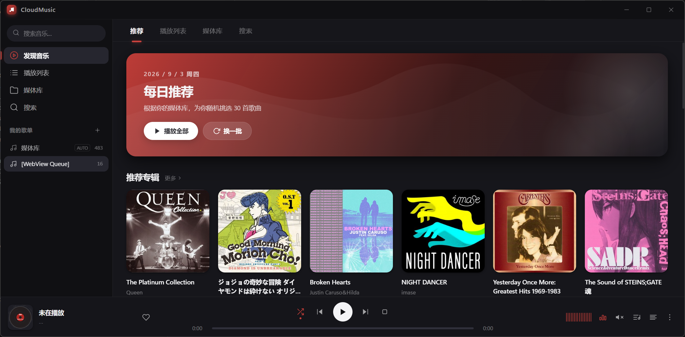</td>
    <td>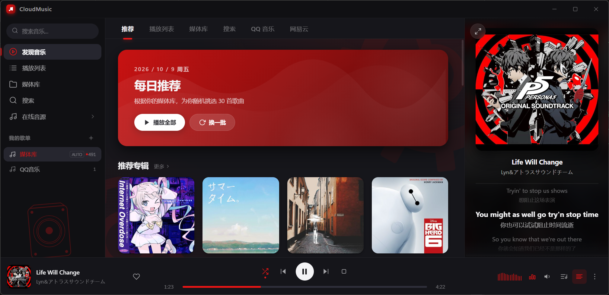</td>
    <td>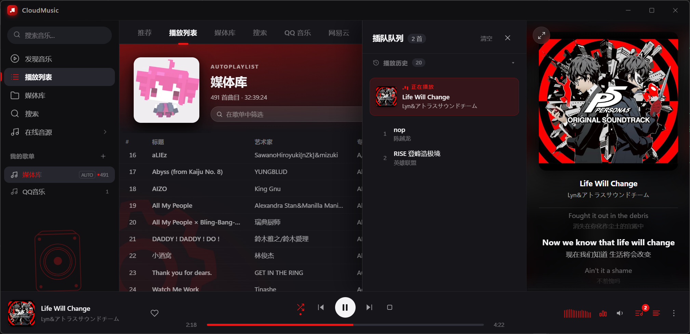</td>
  </tr>
  <tr>
    <td>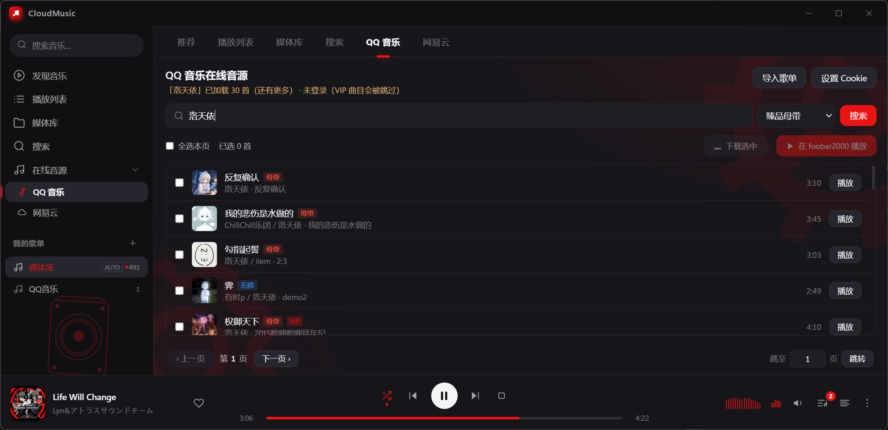</td>
    <td>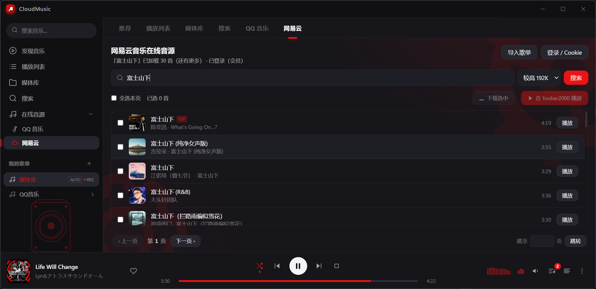</td>
    <td>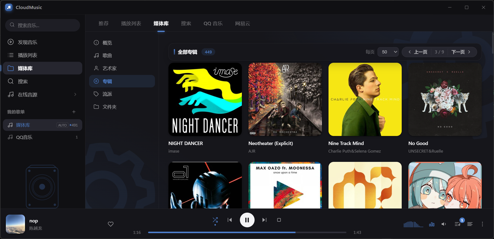</td>
  </tr>
  <tr>
    <td>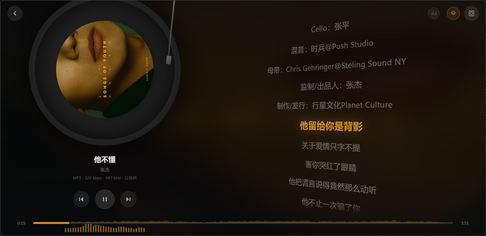</td>
    <td>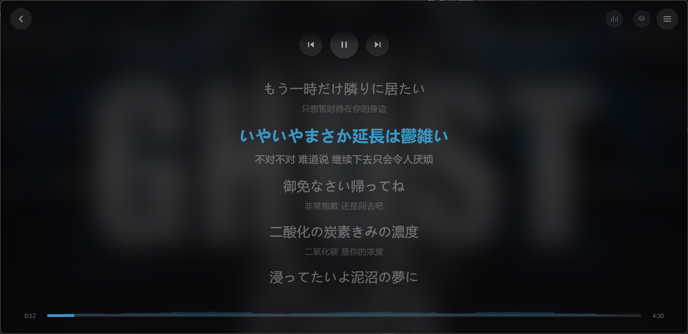</td>
    <td>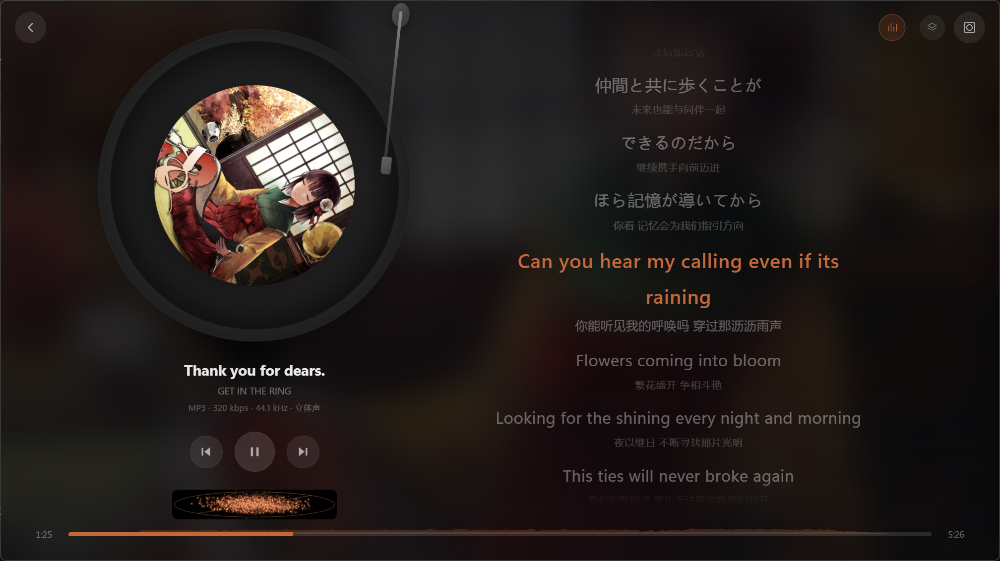</td>
  </tr>
  <tr>
    <td>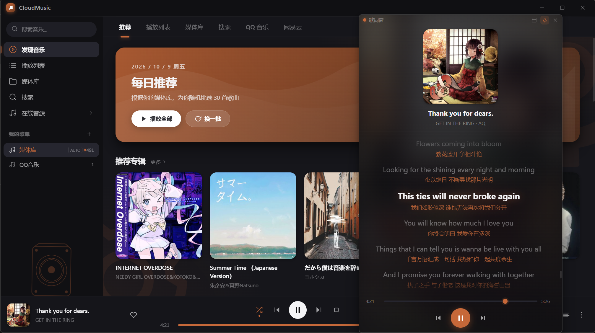</td>
    <td>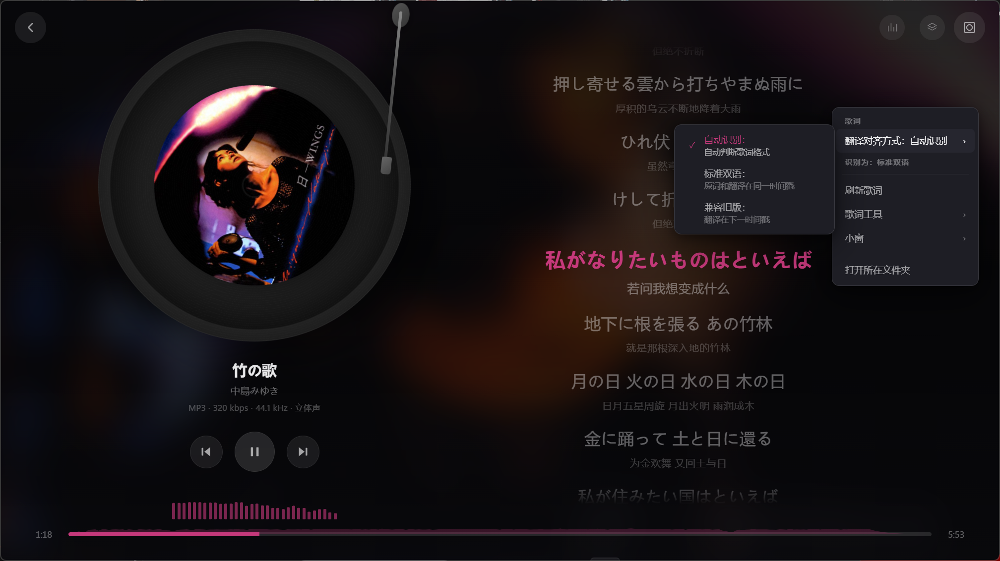</td>
    <td>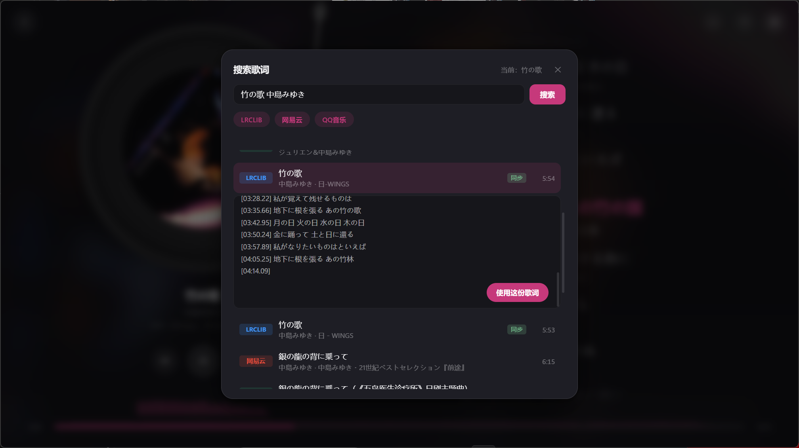</td>
  </tr>
</table>

## 核心特性

- **现代化 Web 界面**: 采用简洁大气的设计风格，支持响应式布局，专为桌面端优化。
- **沉浸式黑胶体验**: 独特的 Vinyl 动画播放器，包含唱片旋转和唱针动画，还原真实听歌氛围。
- **沉浸式 3D 歌词墙**: 全屏歌词可切换为“整块歌词贴在一面斜墙上”的 CSS 3D 透视效果，当前行从墙面微微鼓起，并带随封面主色调联动的柔光。开关在右上角、状态记忆、默认关闭。
- **发现与探索**: 专属“发现”页面，展示推荐专辑、随机曲目和最近播放记录。
- **动态歌词**: 支持逐行与**逐字**（ESLyric `<mm:ss.xx>` 精准歌词）高亮、**双语翻译成组显示**（同刻 / 译文延后一行两种写法自动判别归一、原文为主译文为副）、点行跳转与独立的全屏歌词模式；歌词面板右键菜单可手动指定配对方式（按文件记忆）。内置 8 层编码检测引擎，可正确识别 GBK/GB18030、UTF-8、UTF-16 等编码的 LRC 文件。
- **强大的媒体库**: 支持按艺术家、专辑等维度浏览与管理本地音乐。
- **QQ 音乐在线音源（可选）**: 页内桥接，「QQ 音乐」页可直接搜索试听、勾选播放与下载（无损/母带落盘），自动匹配在线封面与歌词，支持「复制导出脚本 + 文本匹配」导入自己的 QQ 歌单；不需要外部桥接程序、端口或 node.js。见下方专节。
- **网易云音乐在线音源（可选）**: 与 QQ 音乐同一套页内桥接架构的第二个平台页 —— 免登录的免费额度更宽（多为 320K），**在线即可听无损 FLAC**，歌单可直接粘贴链接/ID 导入，会员曲目会明确标注「VIP · 试听」并跳过。同样无外部程序 / 端口 / node.js。见下方专节。
- **内置标签编辑**: 无需离开界面即可在“标签编辑器”中修改歌曲元数据；多选后可批量编辑标签或批量从歌单删除。
- **播放队列管理**: 抽屉式播放队列，支持拖拽排序。

## 环境要求

1.  **foobar2000**: 确保已安装 foobar2000 音频播放器。
2.  **foo-ui-webview2**: 运行此主题所必需的 foobar2000 组件插件。请前往 [GitHub - NereaFantasia/foo_ui_webview2](http://github.com/NereaFantasia/foo_ui_webview2) 下载并安装对应版本。

## 安装指南

1.  **获取主题**: 将本项目（`foobar2000_web_theme`）下载或克隆到本地。
2.  **定位路径**: 确认包含 `index.html` 文件的目录绝对路径。
3.  **配置插件**:
    *   重新进入foobar设置页面
    

## QQ 音乐在线音源

侧边栏「QQ 音乐」页 = 搜索 → 勾选 → 在 foobar2000 播放 / 下载选中。整条链路（搜索 / 直链解析 / 歌词 / 封面）都在主题页面内走宿主 foo_ui_webview2 的原生 HTTP 客户端，**没有本地进程、端口、开关脚本，也不需要 node.js / Python**；随 foobar 启动而在、关闭而消。功能创意与原版桥接程序来自贴吧用户 @凌月冰天。

- **免登录可用**：免费曲库（128K MP3 / AAC 96K）直接搜、直接放。**VIP 曲目 / 无损**需要在浏览器登录 `y.qq.com` 后按页面右上角「设置 Cookie」的说明粘贴一次 Cookie（存 localStorage；失效重贴即可，表现为 VIP 曲目全部解析不到）。
- **在线播放固定 MP3 流播，无损走下载**：QQ 的 CDN 给所有直链打的 `Content-Type` 都是 `audio/x-ogg`，foobar2000 会按类型把 FLAC / AAC 直链误当 Ogg 拒解，所以在线播放只解析 MP3 档（320 → 128，保证可播）。**音质下拉框只影响下载**：要无损 / 母带，用「下载选中」落盘后在本地播放（文件字节完好，可直接加进媒体库）。
- **下载位置固定**：`<foobar2000 配置目录>\QQ音乐下载\`（宿主的写盘策略只放行配置目录）。下载开始后列表上方会常驻显示「下载保存到 …」，可一键打开文件夹或复制路径；音频与同名 `.lrc` 一起写入，整目录可加进媒体库。下载中再点一次 = 停止。
- **「QQ音乐」歌单**：勾选播放的曲目会**追加**到这个固定歌单末尾并从新曲开播，之前播的歌原地保留。歌单里存的是带签名的 CDN 直链，**vkey 约两小时过期**，过期条目再点会播放失败 —— 回页面重新勾选播放即可刷新（无损/母带请下载落盘，更稳）。
- **导入自己的歌单**：「导入歌单」面板点「复制导出脚本」→ 到 `y.qq.com` 歌单页 F12 控制台粘贴回车（脚本自动滚动抓全曲目，导出「歌名 - 歌手」每行一首）→ 回主题粘贴文本、指定目标歌单名开始导入。逐首多轮搜索匹配（宁缺勿错，失败行会放回文本框可编辑重试），单次上限 300 首、可随时停止。
- **封面与歌词自动匹配**：在线曲目的封面由「直链文件名里的 mediaMid → 专辑」反查腾讯图床得到（会随播放/下载记录，缓存复用）；歌词按「标题 + 歌手 + 时长」多轮放宽搜索匹配，本地同名 `.lrc` / `%profile%\lyrics` 歌词库优先。**歌词面板右键 →「刷新歌词」**会同时清掉在线匹配缓存。
- **在线曲目没有本地文件**：右键菜单的「编辑标签」「在资源管理器中显示」会置灰并说明原因（批量标签编辑会自动跳过在线曲目）；星级评分、封面、歌词、波形、试听、加入队列这些不受影响。

## 网易云音乐在线音源

侧边栏「网易云」页 = 搜索 → 勾选 → 在 foobar2000 播放 / 下载选中。与「QQ 音乐」页同一套**页内桥接**架构（`js/netease-core.js` + `js/ui-netease.js`）：搜索 / 直链解析 / 歌词 / 封面 / 歌单全部走宿主 foo_ui_webview2 的原生 HTTP 客户端，**无本地进程、端口、node.js 依赖**。

免登录就能用，而且免登录的额度比 QQ 宽松很多（同一批热门搜索实测：约一半曲目**完整可放**，其中绝大多数是 320K；QQ 那边免登录多为 128K 且可放比例更低）。

- **会员曲目会明确标注**：未登录 / 非会员时，会员曲目接口照样返回一个能播的 URL，但内容是 **30/45 秒试听片段** —— 页面把这类曲目标成「VIP · 试听」并在播放/下载时跳过，**不会往歌单里塞 30 秒的"歌"**。
- **在线就能听无损**：网易云 FLAC 直链的 `Content-Type` 是 `application/octet-stream`（MP3 是 `audio/mpeg`），foobar 按内容嗅探即可正确解码 —— 不像 QQ 那边被 `audio/x-ogg` 干扰、只能流播 MP3。所以音质下拉框（标准 128K / 较高 192K / 极高 320K / 无损 FLAC / Hi-Res）**同时作用于在线播放与下载**；要不到的高档位自动降级，并按返回的真实档位如实回填（不会把降级结果报成无损）。
- **登录（可选）**：点「登录 / Cookie」展开面板 —— 与「QQ 音乐」页同一套最简模型：**再点一次收起（与「导入歌单」同一套开关手感），面板里也有「收起」**，面板与搜索 / 列表共存；取 Cookie 的步骤收在「怎么取？」里按需展开。登录态在 `MUSIC_U` 上，而它是 **HttpOnly** 的 —— 控制台里 `copy(document.cookie)` **读不到**它，localStorage / sessionStorage / IndexedDB 里也没有副本，所以只能去开发者工具里取：F12 → 网络 → 任选一个请求 → 右键「以 cURL 格式复制」→ 整条粘贴到面板（会自动挑出 Cookie），或从「应用 → 存储 → Cookie」复制 `MUSIC_U`。保存后**当场校验**并回报「登录成功 + 会员有效期至 X」。
- **歌单导入：直接粘贴链接或 ID**（公开歌单与官方榜单免登录可读全部曲目，实测 200 首一次拿全），不需要 QQ 那套「导出脚本 + 文本匹配」。单次上限 300 首，只有试听片段的曲目会被跳过并说明原因。
- **封面与歌词**：搜索响应自带封面直链（取图时缩到 `?param=500y500`，原图 5MB → 约 330KB），无防盗链。歌词取原文 + 译文（同刻，交给主题归组）；逐字歌词网易云只在加密接口里给，这里拿不到。在线曲目播放/下载时记下「直链 → 歌曲 id / 封面」映射，歌词按 id **精确**取词（比按标题匹配更准），封面兜底据此反查。
- **播放落在「网易云音乐」歌单**：勾选播放的曲目会追加到这个固定歌单并从新曲开播，与「QQ音乐」歌单分开，一眼能看出曲目来自哪个平台。
- **下载位置固定**：`<foobar2000 配置目录>\网易云音乐下载\`，音频与同名 `.lrc` 一起写入。
- **搜索限流已处理**：网易云搜索接口有限流（连续快速请求会回 `code=406 操作频繁`），桥接把搜索串行化并留最小间隔；真被限流时状态栏如实提示稍后再试，且**只影响搜索** —— 同一时刻播放直链 / 歌词 / 封面照常工作（已实测）。

## 双语歌词编辑器（可选，独立于主题）

`tools/lrc-normalizer.html` 是一个**独立的编辑器**，主题不会加载它，按需使用。浏览器直接打开该文件即可，纯本地运行、不联网、不上传。

**为什么需要它**：双语歌词没有统一规范（同刻 / 译文晚一行，还有混用、缺译文、部分翻译等），而且有些文件**写法本身就是错的或自相矛盾的** —— 这种情况下任何自动判断都无法可靠还原。所以这里不猜：给一个能自己动手改的编辑器，加一键识别打底。

**也能从零做时间轴**：手里只有一段纯文本歌词（从网页复制来的原文 + 译文，一个时间戳都没有）时，把歌曲和歌词一起丢进去，播放后跟着节奏按空格打轴，译文行会自动跳过，最后导出成标准 LRC。歌词文本也可以直接粘贴，不必先存成 .lrc 文件。

界面分成**两页**，共用同一份歌词（工具条和播放器两页都在）：

**第 1 页「编辑歌词」**
- **一键识别**：按机械规则逐时间戳块分配主/译文（块内有空槽或制作信息 → 正文都是原文；多行正文 → 首行是上一句的译文；单行 → 原文）。和主题「兼容旧版」用的是同一套规则。
- **手动调整**（编辑器主要能力）：
  - 点行首角色徽标即可在 **主歌词 / 译文** 之间切换；行尾还有「设为译文」「设为主歌词」按钮
  - **↑ ↓** 调整任意行的位置（例如把译文挪到它真正的原文后面）
  - 时间戳可直接点着改；行正文可双击编辑；可删除多余行（如 `//` 占位）
  - **Ctrl+Z / Ctrl+Y** 撤销重做（100 步）
- **实时预览**：右侧按分组的「主 + 译文」显示，和主题里的显示结构一致
- **粘贴文本**：不用非要拖 .lrc —— 点「粘贴文本」把网页 / 记事本里的歌词整段粘进来即可。带 `[mm:ss.xx]` 的行按时间戳解析；**纯文本（没有时间戳）就把所有行的时间戳设为 `00:00.000`**，等你去「打轴」页排；`[ti:]` `[ar:]` 这类元信息行自动归到文件头
  - 粘贴「原文一行、译文一行」交替的双语歌词后，点「**交替配对**」即可把译文行标出来（首行角色不对就先点一下首行徽标再配对）

**第 2 页「打轴」（边听边打时间戳）**
- 顶部播放器：**载入歌曲**（点按钮，或把音频文件拖进窗口 —— 音频进播放器、.lrc/.txt 进歌词，一次拖入两个都生效）、播放/暂停、±5s、可拖进度条、0.5×–1.5× 变速（慢放打轴，时间戳仍是真实时间）
- 载入歌词 → 播放 → 跟着节奏**按空格**（或回车 / 点「打轴」大按钮）就把当前播放时间打给目标行，打完自动跳下一句；勾选「**跳过译文行**」时译文行不会被停下来（它的时间在导出时按所选写法统一写）
- 快捷键：**空格 / 回车** 打轴 · **Backspace** 撤销上一次（数据和时间戳都退回上一句）· **P** 播放/暂停 · **← →** ∓3 秒（Shift 微调 0.5 秒）· **S** 从此行播（回退 1.2 秒起播）
- 下面的歌词列表**点任意一行 = 从那一句开始打**（重打某几句时用）；「回到第一句」把目标放回开头，「全部归零」把所有歌词行时间戳清成 `00:00.000`（可撤销）
- 支持浏览器能解码的格式（mp3 / m4a / flac / wav / ogg 等）；APE / WMA / DSD 打不开会提示

**导出**：选「标准双语」（译文与原文同刻）或「兼容旧版」（译文写在下一句原文时间戳上）后下载；**只改时间戳与行顺序，不改一个字**；元信息行（`[ti:]` `[ar:]` …）原样保留；UTF-8 带 BOM，可直接覆盖原文件（建议先备份）。文件按**时间戳升序**排列（同一时间戳保持列表先后、主歌词在译文前），所以只重打一句也不会出现时间倒退；若还有多行是 `00:00.000`（多半是没打完），下载前会弹窗提示。
- 实测：抽样 60 个歌词文件「一键识别 + 导出标准双语」后，在主题里 **60/60 都能被确定性识别**（不再依赖任何猜测）

## 项目结构

本项目采用模块化结构，便于维护和二次开发：

- `index.html`: 单页应用入口，构建整个应用界面结构（侧边栏、主页、弹窗等）。
- `guide.html`: 包含详细的版本更新日志、功能特性说明及键盘快捷键指南。
- `css/`: 样式表目录。
    - `layout.css`: 整体布局（侧边栏、主内容区、底部栏）。
    - `components.css`: 各功能组件样式（歌单页、发现页、歌词、播放控制、黑胶唱盘）。
    - `utilities.css`: 通用工具类（弹窗、上下文菜单、提示条）。
- `js/`: 核心业务逻辑与渲染模块。
    - `core.js`: API 封装与状态管理。
    - `lyric-core.js`: 多编码歌词引擎（8 层编码检测 + LRC/ESLRC 模块化解析 + 同刻行归组）。
    - `ui.js`: 基础渲染层。
    - `ui-lyrics.js`: 歌词面板加载与渲染。
    - `ui-discover.js`, `ui-playlist.js`, `ui-library.js`: 各主要页面的视图逻辑。
    - `ui-nowplaying.js`: 沉浸式播放模式（黑胶动画 + 歌词 3D 斜墙）。
    - `ui-tags.js`: 标签编辑器与批量编辑 / 批量删除逻辑。
    - `qqmusic-core.js`: QQ 音乐页内桥接（搜索 / 直链解析 / 歌词匹配 / 封面下载 / Cookie）。所有上游 HTTP 走宿主的**异步**客户端（`async:true` + `http:response` 事件 + `http.abort` 超时取消）—— 用 `async:false` 会让宿主在自己的 UI 线程上做完整个请求，请求多慢 foobar 主窗口就假死多久。功能创意与原版桥接来自贴吧 @凌月冰天。
    - `ui-qqmusic.js`: QQ 音乐在线音源页（搜索 / 翻页 / 勾选播放 / 下载 / 歌单导入 / Cookie 面板）。
    - `netease-core.js`: 网易云音乐页内桥接（搜索 / 批量直链解析 / 歌词匹配 / 封面 / 歌单读取 / Cookie）——与 QQ 桥接同构，同样全异步走宿主 HTTP；免签名接口（cloudsearch、player/url、lyric、v6/playlist/detail），搜索带串行化与限流冷却，试听片段（30/45 秒）单独识别。
    - `ui-netease.js`: 网易云音乐在线音源页（搜索 / 翻页 / 勾选播放 / 下载 / 按链接或 ID 导入歌单 / Cookie 面板 + 保存后校验会员状态）。
    - `lyrics-resolver.js`: 歌词加载链路（本地同名 .lrc / 歌词库优先 → 页内桥接联网匹配兜底；在线曲目按直链归属分发到 QQBridge / NeteaseBridge，网易云走「直链反查 id → 按 id 精确取词」）。
    - `artwork-resolver.js`: 封面就近兜底（封面目录扫描打分 + 在线曲目专辑图反查，在线图经 QQBridge / NeteaseBridge 的 `coverDataUrl` 缓存下载）。
    - `qq-playlist-export.js`: QQ 音乐歌单导出脚本（「导入歌单」面板「复制导出脚本」按钮的源码，粘贴到 y.qq.com 歌单页控制台运行）。
    - `controls.js`: 播放控制交互绑定。
    - `app.js`: 初始化入口。
- `sdk/`: API 桥接文件 (`bridge.global.js` 等)，负责与 foobar2000 核心交互。
- `static/`: 静态资源文件（图片、占位符 SVG）。

## 快捷键与操作

- **侧边栏导航**: 使用左侧边栏切换“发现”、“播放列表”、“媒体库”、“搜索”，以及两个在线音源页「QQ 音乐」和「网易云」。
- **播放控制**: 底部控制栏提供播放/暂停、上一首/下一首、进度条拖拽及音量调节。
- **全屏歌词/沉浸模式**: 点击底部或右上角的全屏按钮进入黑胶沉浸模式。
- **编辑标签**: 在歌曲列表中右键点击曲目，选择“编辑标签”进行修改；多选 2 首及以上时，底部批量栏可批量编辑标签或从歌单删除（右键到已选中的曲目会整组删除）。
- **沉浸式 3D 斜墙**: 进入沉浸模式后，点右上角“显示模式”左侧的小圆钮切换（亮起为开启，状态自动记忆）。
- **歌词右键菜单**: 在歌词面板（或沉浸式页面的歌词区）右键打开 ——「翻译对齐方式」二级菜单可切换 自动识别 / 标准双语 / 兼容旧版（选择按文件记忆），另有 刷新歌词 / 复制歌词 / 打开所在文件夹。

## 更新摘要 · v2.5.4

**新增「网易云」页：第二个页内在线音源（与 QQ 音乐同架构）**

- **新增 `js/netease-core.js` + `js/ui-netease.js`**：侧边栏多一个「网易云」页，`TAB_IDS` 加一个键、`index.html` 加导航与面板，其余照搬 QQ 页的形态。搜索 / 直链 / 歌词 / 封面 / 歌单读取全部走宿主原生 HTTP（无 CORS、无本地进程 / 端口 / node.js），上游接口全部**免签名**（`cloudsearch/pc`、`song/enhance/player/url`、`song/lyric`、`v6/playlist/detail`）。
- **在线即可听无损**：实测网易云 FLAC 直链的 `Content-Type` 是 `application/octet-stream`（MP3 是 `audio/mpeg`），foobar 靠内容嗅探就能解码 —— QQ 那边因 `audio/x-ogg` 只能流播 MP3 的限制在这里不存在。音质下拉框因此**同时管在线播放与下载**，档位以接口返回的**真实** level 回填（要不到会自动降级，不会把 320K 报成无损）。
- **试听片段单独识别（重要）**：未登录 / 非会员时，会员曲目接口照样返回一个能播的 URL，内容是 30/45 秒片段。桥接按 `freeTrialInfo` 识别出来，页面标「VIP · 试听」并在播放/下载时跳过并说明原因 —— 否则歌单里会混进一堆 30 秒的"歌"。
- **歌单导入改为「贴链接 / ID」**：公开歌单与官方榜单免登录可读全部曲目（实测 200 首一次拿全、454ms），不再需要 QQ 那套「导出脚本 + 文本匹配」。批量解析一次 10 首、并发 3 条，200 首约 3 秒。
- **Cookie 说明按网易云的实际情况重写**：登录态在 `MUSIC_U` 上且它是 **HttpOnly**，所以 QQ 那种「控制台跑 `copy(document.cookie)`」在这里**拿不到登录态**。面板给的两种正确做法是「F12 → 网络 → 任选请求 → 右键『以 cURL 格式复制』→ 整条粘贴」（解析器会自动挑出 Cookie）与「应用 → 存储 → Cookie 里复制 `MUSIC_U`」；保存后**当场校验**账号并回报会员有效期，避免"看起来存上了但 VIP 曲目还是试听"。
- **歌词 / 封面按平台分发**：`lyrics-resolver` 与 `artwork-resolver` 原来硬编码 `QQBridge`，现在按直链归属分发。网易云直链不含歌曲 id，桥接在播放 / 下载时记下「直链 → 歌曲 id / 封面」映射（持久化 400 条），歌词据此**按 id 精确取词**（实测：直链推出的标题是乱码片段，靠 id 仍取到《富士山下》正确歌词）；封面同样反查后经宿主下载成 dataURL（取色可用）。
- **搜索限流已处理**：网易云搜索接口连打十几次会回 `code=406 操作频繁`。搜索已串行化并留最小间隔（实测连打 5 次全部正常）；真被限流时状态栏如实提示，且限流**只作用于搜索** —— 直链 / 歌词 / 封面照常。
- **扫码登录试过，最终放弃（附原因）**：曾实现过「面板内画二维码 → 手机 App 扫码确认 → 主题自己收凭据」，链路本身是通的（取 unikey、轮询、扫码状态都能拿到，最后一步 803「授权登陆成功」也到了），但**宿主的 HTTP 客户端对多个 `Set-Cookie` 只保留最后一个**（实测：让服务端同时下发 `a=1; b=2`，宿主只给出 `b=2`），而网易云在这一步会连发 `MUSIC_U` 与其它 Cookie —— `MUSIC_U` 必然丢掉，拿不到登录态。这是宿主的限制、改不了解析能解决，所以扫码这条路连同它依赖的二维码库（MIT 的 qrcode-generator，56KB）一起移除了，只保留手动粘贴。顺带修掉的两个真 bug：① 802「授权中」的响应里**也带昵称和头像**，早先拿"有昵称"当成功判据，一扫码就误报并停掉轮询；② 轮询收 Cookie 时用覆盖写入，会把已存的登录态冲掉（已改为合并，随扫码一起移除了）。
- **修复：在线曲目在 foobar 里显示的曲名是乱码（搜索列表却是对的）**。在线曲目是裸直链、没有任何标签，主题取名时会退回「URL 最后一段」—— 而 CDN 直链的签名参数里带 `/`，于是界面把签名碎片当成了歌名（实测底栏与歌单行显示 `GsvWzqeUwhOhb+2GUTYfbcNo=`、艺术家「未知艺术家」）。现在两个桥接在解析 / 播放 / 下载时把「直链 → 歌名 / 歌手 / 专辑」记进映射表（localStorage 持久化、上限 400 条），并注册给主题新增的 `CM.onlineName`；`CM.trackName` / `CM.trackArtist` 取名时优先查它 —— 底栏、播放列表行、播放队列、正在播放页、各处提示一次性全部正确（实测歌单行从乱码变为「鲜花 / 回春丹」）。顺带把 URL 兜底也修了：先切掉查询串再取文件名，未映射的直链至少显示 `xxx.mp3` 而不是签名碎片。**注意**：改 `js/*.js` 后要同步升 `index.html` 里的 `?v=NN`，否则 WebView2 会命中缓存、改动不生效（这次就踩到了）。
- **顺带修掉一个既有 bug（影响 QQ 的歌词 / 歌单匹配）**：繁→简对照表用「平面字符串 + 下标奇偶配对」实现，而表里含 293 个非 BMP 字符（如 `𠮶`，在 UTF-16 里占两个码元），第一个非 BMP 字符之后奇偶整体错位 —— 实测 3222 对里**只有 1388 对能转对，还会把「周」错转成「進」**，等于给曲名打分喂噪音。改为按码点成对解析成映射表后 3222/3222 全对（`漢語測試 → 汉语测试`、`周杰倫 → 周杰伦`）。QQ 与网易云共用这张表，两边受益；繁体标题的歌词匹配与歌单导入因此更准。

详细说明见 [`default/guide.html`](default/guide.html) 的 v2.5.4 更新日志。

## 更新摘要 · v2.5.3

**QQ 音乐页内桥接：整条链路搬进主题页面**

> QQ 音乐在线音源的功能创意与原版桥接程序来自贴吧大佬 **@凌月冰天**，本版在其基础上迁入页内实现，感谢大佬的思路与付出。

- **利用插件自带网络服务，减小了体积**：新增 `js/qqmusic-core.js`（页内桥接模块），QQ 音乐的 搜索 / 音源解析 / 歌词匹配 全部走宿主 foo_ui_webview2 的原生 HTTP 客户端（无 CORS、免签名），播放与下载用解析出的 CDN 直链直接交给 foobar2000。不再需要单独的桥接程序与本地端口，**无进程、无端口、无 node.js / Python 依赖，随 foobar 启动而在、关闭而消**。
- **「一键登录」改为「设置 Cookie」面板**：在浏览器登录 y.qq.com 网页版后，F12 打开控制台运行面板里提供的 `copy(document.cookie)` 命令（Cookie 自动进剪贴板），粘贴保存（localStorage 持久化）。免费曲库不需要登录；Cookie 失效时 VIP 曲目会全部解析不到，重贴一次即可。
- **自动降级与探测**：直链解析按「母带 → Hi-Res → FLAC → AAC 192 → 320 → AAC 96 → 128」整链一次请求、逐档轻量探测；匿名搜索被限流时自动降级旧版接口 / 联想搜索；繁体标题经内置繁→简表参与歌词打分。
- **封面兜底与歌词实时匹配改为页内原生**：封面「就近兜底」用宿主 file.list/file.read 完成（音频目录 → 封面子目录 → 上一级 → 上一级封面子目录，封底/内页词降权）；歌词实时匹配直接调用 `QQBridge.lyric()`（多轮放宽搜索 + 标题/歌手/时长打分）。**在线曲目也有封面**：播放时记录「直链 mediaMid → 专辑」映射，封面兜底从 CDN 直链反查腾讯图床；同时修掉宿主对在线曲目返回 `fb2k://` 代理地址但加载失败、封面永远显示占位图的问题。
- **「QQ音乐」歌单：追加播放**：勾选播放的曲目会追加到固定唯一的「QQ音乐」歌单末尾并从新曲开播，之前播的歌原地保留，听完可以直接在歌单里接着选下一首；宿主 playlist.getAll 抖动导致的同名重复歌单会在播放后自动清到只剩一个。直链 vkey 约两小时过期，过期条目再点会播放失败，重新勾选播放即可刷新。
- **在线播放固定 MP3 流播，无损走下载**：QQ 的 CDN 给所有直链打的 Content-Type 都是 `audio/x-ogg`，foobar2000 按类型选解码器 —— FLAC / AAC 直链会被误当 Ogg 拒解（「不支持的格式或文件损坏」；MP3 靠帧嗅探不受影响）。因此在线播放与导入固定解析 MP3 档（320 → 128），保证可播；无损 / Hi-Res 请用「下载选中」落盘后本地播放（文件字节完好，可直接加进媒体库）。音质下拉框只影响下载。
- **歌单导入（文本匹配）**：官方已对账号歌单详情接口启用请求签名与加密，第三方无法直接读取账号歌单里的曲目 —— 采用「复制导出脚本 + 文本匹配」：主题「QQ 音乐 → 导入歌单」面板点**「复制导出脚本」**→ 到 y.qq.com 歌单页按 F12 → 控制台粘贴回车（脚本源码见 [`default/js/qq-playlist-export.js`](default/js/qq-playlist-export.js)，自动滚动抓全曲目，导出「歌名 - 歌手」每行一首，自动复制并下载 txt），回到主题粘贴、指定目标歌单名即可：逐首多轮搜索匹配（原名 → 去括号 → 清轨号 → 只按歌名 → 容错写反的行；与歌词匹配同款置信阈值，宁缺勿错）、解直链后追加进歌单并从第一首开播；单次上限 300 首，导入中可随时停止，失败行放回文本框（可编辑重试），状态栏按原因归类汇总。
- **下载保存位置条**：下载开始后列表上方常驻显示「下载保存到 <目录>」，一键打开文件夹或复制路径。

**本次发布同时修掉了在线音源偶发卡死 foobar 的问题（根因修复）**

- **根因**：QQ 音乐的每一个请求（搜索 / 直链 / 歌词 / 封面）原来都走宿主的**同步** HTTP（`async:false`）—— 宿主会在自己的 UI 线程上把整条请求做完才返回，请求有多慢 foobar 主窗口就假死多久。对照实验：请求一个连不上的地址（TCP 超时 21 秒）时，主窗口 21 秒不响应任何系统消息（202 次窗口探测里 80 次无响应）；平时那些 150–400 毫秒的请求则是一串卡顿，切歌时「歌词匹配 + 封面下载」叠加最明显。
- **修法**：整条链路改成异步（`async:true` + `http:response` 事件，宿主网络线程完成，页面线程全程可响应），超时用 `http.abort` 真正取消（普通请求 15 秒 / 探测 8 秒）。**同一场景复测：21 秒的请求，主窗口 0 次无响应（最慢 6 毫秒）**。事件监听改为模块加载时就挂上并按 requestId 缓存回包，快响应不会丢。
- **封面缓存**：在线封面原本**没有缓存**，列表每次重绘都同步重下一遍（实测 3 张封面 1.2 秒全在主线程上冻着）。现在同一张专辑只下一次（上限 30 张），下载失败降级用原始 URL 且单独计数（`CM.artworkStatus().rawFallback`）。
- **批量解析并发 3 条**：勾一批播放/下载不再串行等 N 次「vkey + 探测」，结果仍按勾选顺序回填（第一首必须是 urls[0]，开播索引靠它定位）。实测 4 首 534 毫秒、顺序一致。
- **错误提示如实**：搜到 0 首不再报成「搜索失败」（空结果 / 翻页超范围走空态提示）；歌单写入失败不再静默当成功（此前取不到曲目总数会拿 0 当索引，**提示"已开播"却播了歌单第一首**）；下载中点「停止」不再报成「下载失败」；在线曲目的「编辑标签 / 在资源管理器中显示」置灰并写明原因（没有本地文件），批量标签编辑跳过在线曲目并说明。
- **歌词不再被网络抖动误伤**：只有上游明确回「没有歌词」才进 30 分钟缓存，网络失败不进；右键「刷新歌词」现在会连在线匹配缓存一起清掉。

- 详细说明见 [`default/guide.html`](default/guide.html) 的 v2.5.3 更新日志。

## 更新摘要 · v2.5.2

**双语配对：从「判断」改为机械展开**
- **两种写法自动归一**：歌词的两种常见写法（同刻：原文与译文同一时间戳；译文延后一行：译文写在下一句的时间上）现在会被自动识别并统一成“原文为主、译文为副”的正序显示。判据按脚本族分侧（中日/中韩/英日/俄中等任意两种文字均成立）、不依赖语料分布；判不出的文件可在歌词面板右键菜单里手动指定，选择按文件记忆。
- **延后展开规则完全机械化**（不看语言、不做语义判断）：逐时间戳块处理 —— ① 块内有**空槽**（该时间戳下有一行无正文或只有占位符）或制作信息 → 块内正文都是原文；② 块内有多行正文 → 首行是"上一句的译文"（挂到上一句），其余是原文；③ 只有一行 → 原文。空槽是"这句没有译文"的唯一依据，解析层会保留它（此前被直接丢弃）。
- **相位判定**（决定整个文件按哪种写法展开）：① 取首个跨语言同刻组，用它前面**紧邻且自己落单**的那句原文作锚点；② 锚点失效时改用决定性语言标记（假名/谚文只会出现在原文侧）；③ 按"跨语言同刻组的形态比例"决定是否展开 —— 多数组本来就是同刻写法时直接判为标准双语、不改写。
- **同脚本族的同刻对**用字符重合度区分：译文字面与原文高度重合（日文汉字句 ↔ 中文句，如 `天天天国地獄国` / `天天天国地狱国`）→ 保持主副；两句无关原文（重叠人声、重复段，如 `有了你…` / `去到每一度…`）→ 各自独立成行。
- **主行不再被制作信息抢走**：`[00:00.555]Composed by：X` 与歌词同刻时，主行取歌词行，制作信息降为副行。
- **副标题行归位（第三语言）**：英文原词、罗马音、中英混排的译文（如「无比炽热 Like a Bloody Stone」）也会挂回它所属的原文行，不再出现「一组三行、主行却是上一句译文」。本地 445 个歌词文件全量回归：13 个文件改善、0 个变差，其中 `God Knows…`、`Bloody Stream`、`IRIS OUT`、`Butter-Fly` 等已逐条人工核对。
- **覆盖面对比**：自动归一的文件 188 → 209，判不出的 33 → 9（后者多为"没有双语内容"或结构自相矛盾的）。逐句核对过的清单：延后格式 15/15 主行=原文、同刻格式 15/17 保持零改写（另 2 个是核对过的正确修正）。全库 581 文件 × 3 种模式：0 异常、组时间戳 0 倒退。

**歌词面板右键菜单**
- 在歌词面板或沉浸式页面的歌词区右键 ——「翻译对齐方式」是一个二级菜单（鼠标悬停展开，当前项带 ✓）：**自动识别 / 标准双语 / 兼容旧版**，选择按文件记忆；下方是 刷新歌词 / 复制歌词 / 打开所在文件夹。歌词没有同刻行时（纯文本、逐字歌词等）不显示对齐项。

**双语歌词编辑器（可选工具，独立于主题）**
- `tools/lrc-normalizer.html`**不放在 default 里、主题不加载它**：浏览器直接打开即可，纯本地运行。分**两页**共用一份歌词 —— 「**编辑歌词**」页：一键识别打底 + 手动调整（点角色徽标切 主/译文、↑ ↓ 移动、＋ 插入/追加行、✕ 删除、时间戳与正文**就地编辑**、Ctrl+Z/Y 撤销重做、整窗口拖放换文件、清空），右侧实时预览主题里的显示效果，导出两种写法；「**打轴**」页：载入歌曲边听边按空格打时间戳，译文行自动跳过，点列表任意一行可从那句重打。
- **歌词文本可直接粘贴**（不限于拖 .lrc）：带时间戳的按时间戳解析（可再重打），**纯文本的时间戳全部为 `00:00.000`** 等打轴；`[ti:][ar:]` 归到文件头；原文/译文逐行交替的内容点「交替配对」即可分出译文行。
- **打轴快捷键**：空格 / 回车 打轴、Backspace 撤销、P 播放/暂停、← → ∓3 秒（Shift 微调）、S 从此行播；支持 0.5× 慢放。导出的文件按时间戳升序排列，没打完（多行仍是 00:00.000）会在下载前弹窗确认。
- 实测「一键识别 + 导出标准双语」抽样 60 个文件，在主题里 **60/60 都能被确定性识别**（零改写、无歧义）—— 源文件写法本身就错/自相矛盾的情况，用它手动改完即可。

**其它修复与性能**
- 归一后组时间戳可能倒退（会让高亮二分查找跳错行）→ 归一成功后恢复一次稳定排序；说话人标签（`Charlie Puth：`）按信息行处理，不再干扰相位判定；设置里 `lyricModes` 被写坏时不再抛异常；歌词为空时右键菜单不再残留上一首的识别结果；二级菜单在主菜单滚动时自动收起。
- 无同刻组直接早退（单语言歌词解析 −18%）；每行脚本族只算一次、关系式由最坏 O(n²) 降为 O(n)（有同刻组的文件 −20%）；去掉判定链路上重复的脚本分类与重复的同刻组检测。

## 更新摘要 · v2.5.1

- **GBK 中文歌词不再被误判为乱码**: 原评分让 euc-kr / windows-874 / windows-1251 仅凭“出现即加分”就能胜过 GBK（本地 582 个歌词文件中 75 个中招，占可判定样本的 13.8%）。改为按脚本纯度评分、只对不可伪造的决定性标记（假名占比、谚文纯度）给高权重，同一语料复测为 0 误判。
- **逐字歌词**: 支持 ESLyric 的 `<mm:ss.xx>` 精准歌词标记（此前会把标记当正文原样显示）。
- **翻译/音译同刻行**: 归为一组显示（主行 + 副行），整组一起高亮与居中，不再“只亮一行”也不丢行；纯文本歌词不再被误当作同步歌词。
- **格式兼容**: `[h:mm:ss]`、`[mm:ss.xx-N]` 等变体不再被整首当纯文本；负时间标签按负值解析。
- **标签编辑数据安全**: 多值标签（数组）不再因“未改动也被判为已改动”而被压成单值；写入过程中关闭编辑器不再报错。
- **批量删除**: 批量操作栏新增「从歌单删除」，右键命中多选时删除整组；锁定/自动歌单不再出现该操作（此前点了会静默失败）。
- **其他修复**: 搜索并发时旧结果覆盖新结果、ESLyric 开关连点失效、`playlist.replaceAllAndPlay` 参数名、版本号显示不一致、移除无调用者的旧解析代码与编码记忆层。
- **新功能**: 沉浸式 **3D 斜墙歌词**（真 CSS 3D 透视 + 当前行鼓起 + 随封面色柔光，可开关、默认关）。

详细更新日志与功能指南见 [`default/guide.html`](default/guide.html)。

## 贡献与反馈

如果您喜欢这个主题，欢迎在 Gitee 或 GitHub 上为我们点亮 Star。

如遇到问题或有任何建议，请移步项目 Issues 页提交反馈。
